<h2>TensorFlow-FlexUNet-Image-Segmentation-Aorta (2026/03/06)</h2>
Sarah T.  Arai 
Software Laboratory antillia.com  
This is the first experiment of Image Segmentation for <b>Aorta</b> based on our <a href="./src/TensorFlowFlexUNet.py">TensorFlowFlexUNet</a> 
(TensorFlow Flexible UNet Image Segmentation Model for Multiclass), 
and a 512x512 pixels PNG
<a href="https://drive.google.com/file/d/1a24Qz1_1QxgSv3sTbGFST8j__XGp0onO/view?usp=sharing">
<b>Aorta-ImageMask-Dataset.zip</b></a> which was derived by us from   
<a href="https://www.kaggle.com/datasets/licethyaneth/aorta-segmentation">
<b>Aorta segmentation</b> </a> on the kaggle.com.
  

<b>Actual Image Segmentation for Aorta Images of  512x512 pixels </b> 
As shown below, the inferred masks predicted by our segmentation model trained by the dataset appear similar to the ground truth masks.
 
  
<table>
<tr>
<th>Input: image</th>
<th>Mask (ground_truth)</th>
<th>Prediction: inferred_mask</th>
</tr>
<tr>
<td></td>
<td></td>
<td></td>
</tr>

<tr>
<td>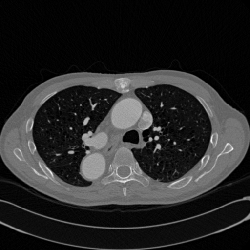</td>
<td></td>
<td></td>
</tr>

<tr>
<td>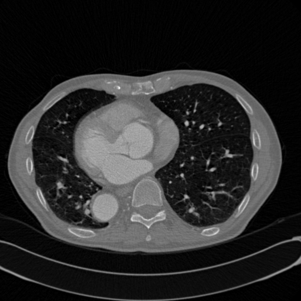</td>
<td></td>
<td></td>
</tr>
</table>

 
<h3>1  Dataset Citation</h3>
The dataset used here was derived from   
<a href="https://www.kaggle.com/datasets/licethyaneth/aorta-segmentation">
<b>Aorta segmentation</b> </a> on the kaggle.com.
  
The following explanation was taken from the kaggle web site.
  
<b>About Dataset</b> 
Dataset built and segmented by me for the development of my project AUTOMATIC SEGMENTATION OF THE ABDOMINAL AORTA IN CARDIAC 
COMPUTED TOMOGRAPHIES USING DEEP LEARNING.
 
 
<b>License</b> 
<a href="https://creativecommons.org/licenses/by/4.0/">Attribution 4.0 International (CC BY 4.0)</a>
 
 
<h3>
2 Aorta ImageMask Dataset
</h3>
 If you would like to train this Aorta Segmentation model by yourself,
please down load our dataset <a href="https://drive.google.com/file/d/1a24Qz1_1QxgSv3sTbGFST8j__XGp0onO/view?usp=sharing">
<b>Aorta-ImageMask-Dataset.zip</b>
</a> on the google drive, expand the downloaded, and put it under <b>./dataset/</b> to be.
<pre>
./dataset
└─Aorta
    ├─test
    │   ├─images
    │   └─masks
    ├─train
    │   ├─images
    │   └─masks
    └─valid
        ├─images
        └─masks
</pre>

<b>Aorta Statistics</b> 
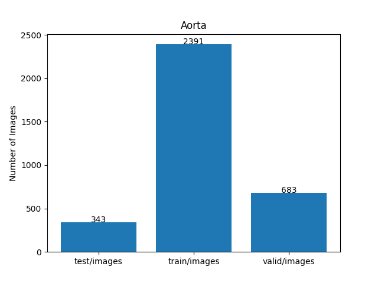 
 
As shown above, the number of images of train and valid datasets is not so large to use for a training set of our segmentation model.
  

<b>Train_images_sample</b> 
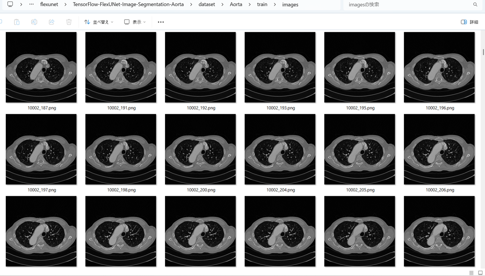
 
<b>Train_masks_sample</b> 
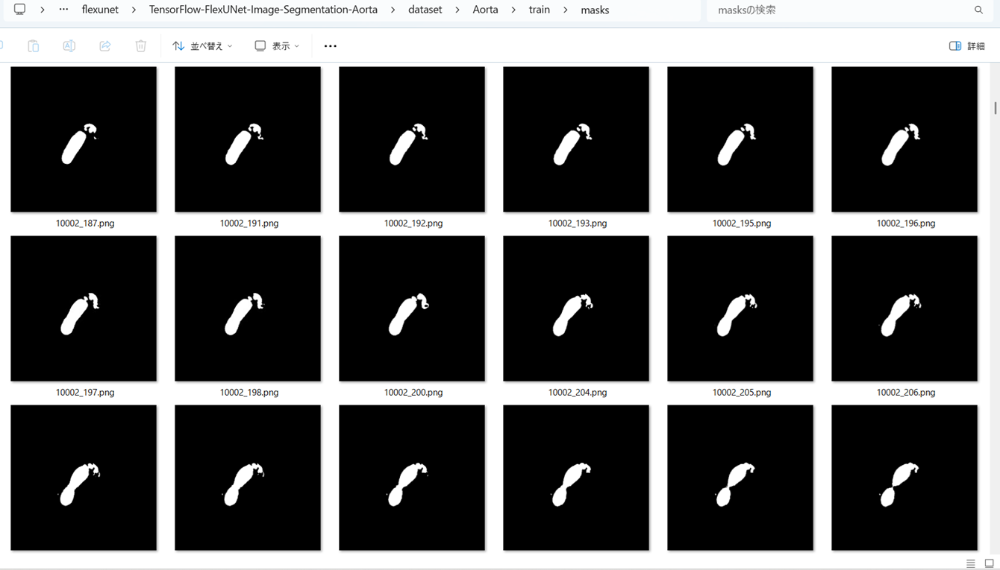
 
<h3>
3 Train TensorflowFlexUNet Model
</h3>
 We trained Aorta TensorflowFlexUNet Model by using the following
<a href="./projects/TensorFlowFlexUNet/Aorta/train_eval_infer.config"> <b>train_eval_infer.config</b></a> file.  
Please move to ./projects/TensorFlowFlexUNet/Aorta, and run the following bat file. 
<pre>
>1.train.bat
</pre>
, which simply runs the following command. 
<pre>
>python ../../../src/TensorFlowFlexUNetTrainer.py ./train_eval_infer.config
</pre>

<b>Model parameters</b> 
Defined a small <b>base_filters=16</b> and a large <b>base_kernels=(11,11)</b> for the first Conv Layer of Encoder Block of 
<a href="./src/TensorFlowFlexUNet.py">TensorFlowFlexUNet.py</a> 
and a large num_layers (including a bridge between Encoder and Decoder Blocks).
<pre>
[model]
image_width    = 512
image_height   = 512
image_channels = 3
input_normalize = True
normalization  = False
num_classes    = 2
base_filters   = 16
base_kernels  = (11,11)
num_layers    = 8
dropout_rate   = 0.05
dilation       = (1,1)
</pre>
<b>Learning rate</b> 
Defined a small learning rate.  
<pre>
[model]
learning_rate  = 0.00007
</pre>
<b>Loss and metrics functions</b> 
Specified "categorical_crossentropy" and "dice_coef_multiclass". 
<pre>
[model]
loss           = "categorical_crossentropy"
metrics        = ["dice_coef_multiclass"]
</pre>
<b >Learning rate reducer callback</b> 
Enabled learing_rate_reducer callback, and a small reducer_patience.
<pre> 
[train]
learning_rate_reducer = True
reducer_factor     = 0.5
reducer_patience   = 4
</pre>
<b>Early stopping callback</b> 
Enabled early stopping callback with patience parameter.
<pre>
[train]
patience      = 10
</pre>
<b></b> 
<b>RGB color map</b> 
rgb color map dict for Aorta 1+1 classes. 
<pre>
[mask]
mask_file_format = ".png"
;Aorta 1+1
rgb_map = {(0,0,0):0, (255,255,255):1}
</pre>
<b>Epoch change inference callbacks</b> 
Enabled epoch_change_infer callback. 
<pre>
[train]
epoch_change_infer       = True
epoch_change_infer_dir   =  "./epoch_change_infer"
epoch_changeinfer        = False
epoch_changeinfer_dir    = "./epoch_changeinfer"
num_infer_images         = 6
</pre>
By using this epoch_change_infer callback, on every epoch_change, the inference procedure can be called
 for 6 images in <b>mini_test</b> folder. This will help you confirm how the predicted mask changes 
 at each epoch during your training process.    
<b>Epoch_change_inference output at starting (1,2,3)</b> 
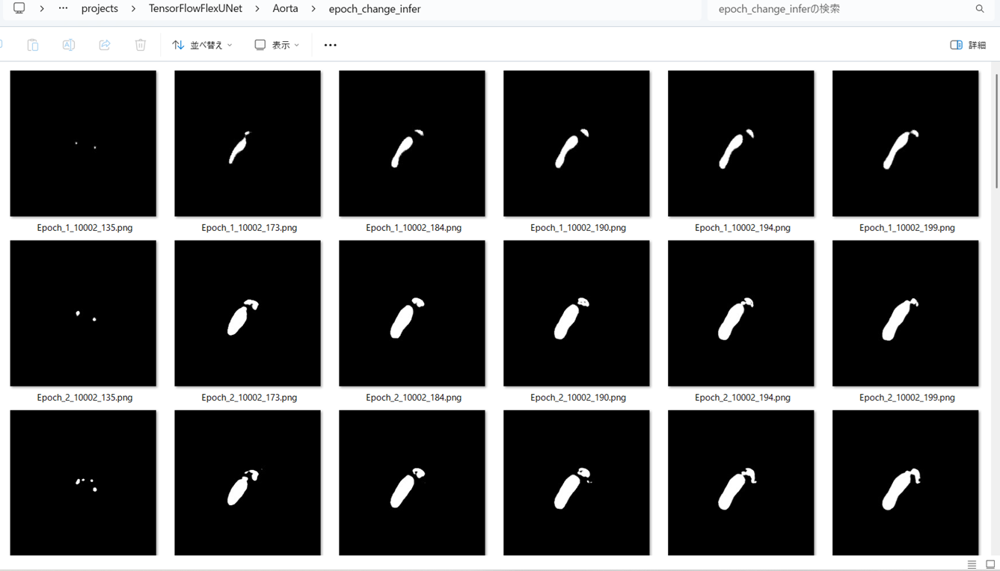 
 
<b>Epoch_change_inference output at middle-point (8,9,10)</b> 
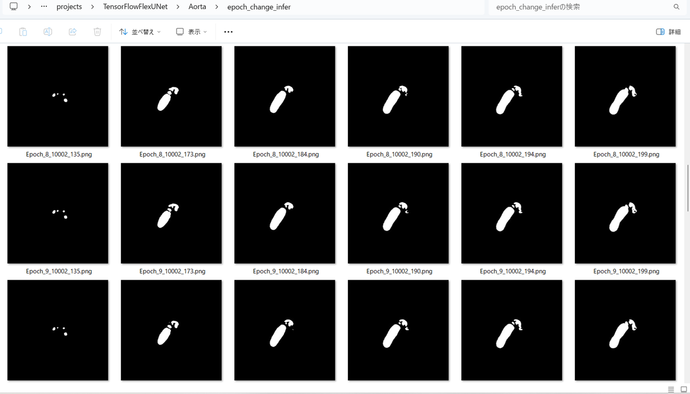 
 
<b>Epoch_change_inference output at ending (18,19,20)</b> 
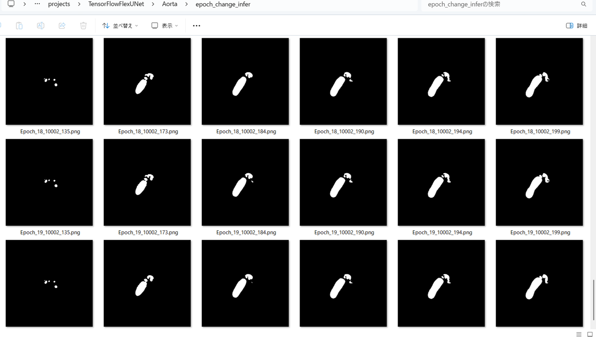 

 
In this experiment, the training process was terminated at epoch 20.  
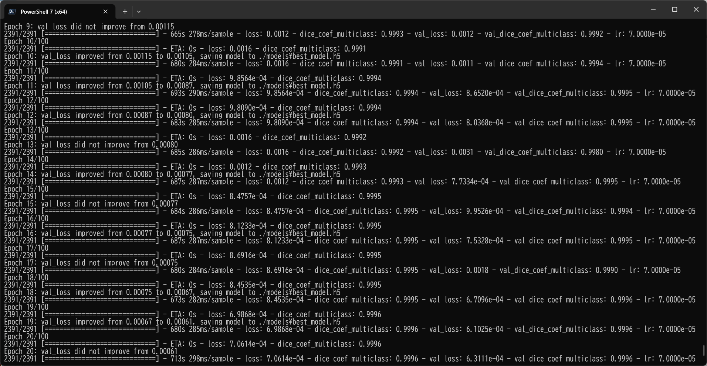 
 
<a href="./projects/TensorFlowFlexUNet/Aorta/eval/train_metrics.csv">train_metrics.csv</a> 
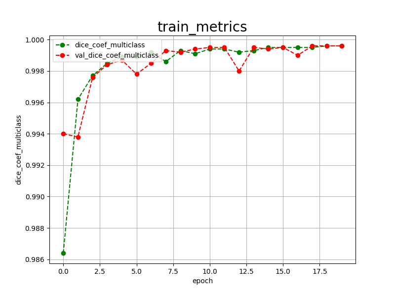 

 
<a href="./projects/TensorFlowFlexUNet/Aorta/eval/train_losses.csv">train_losses.csv</a> 
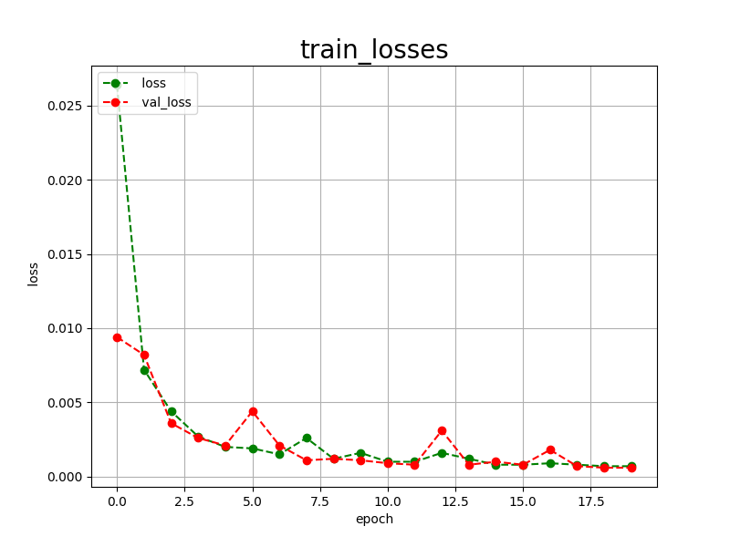 
 
<h3>
4 Evaluation
</h3>
Please move to a <b>./projects/TensorFlowFlexUNet/Aorta</b> folder, and run the following bat file to evaluate TensorflowFlexUNet model for Aorta. 
<pre>
>./2.evaluate.bat
</pre>
This bat file simply runs the following command.
<pre>
>python ../../../src/TensorFlowFlexUNetEvaluator.py  ./train_eval_infer.config
</pre>
Evaluation console output: 
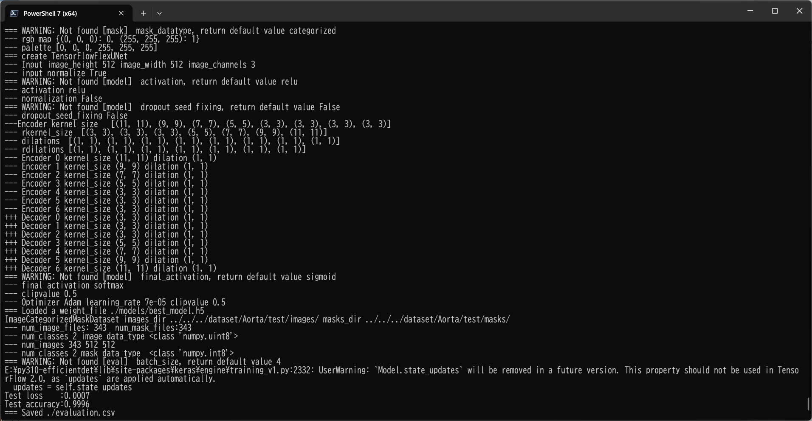
  Image-Segmentation-Aorta

<a href="./projects/TensorFlowFlexUNet/Aorta/evaluation.csv">evaluation.csv</a> 
The loss (categorical_crossentropy) to this Aorta/test was very low, and dice_coef_multiclass  very high as shown below.
 
<pre>
categorical_crossentropy,0.0007
dice_coef_multiclass,0.9996
</pre>
 
<h3>5 Inference</h3>
Please move to a <b>./projects/TensorFlowFlexUNet/Aorta</b> folder, and run the following bat file to infer segmentation regions for images by the Trained-TensorflowFlexUNet model for Aorta. 
<pre>
>./3.infer.bat
</pre>
This simply runs the following command.
<pre>
>python ../../../src/TensorFlowFlexUNetInferencer.py ./train_eval_infer.config
</pre>

<b>mini_test_images</b> 
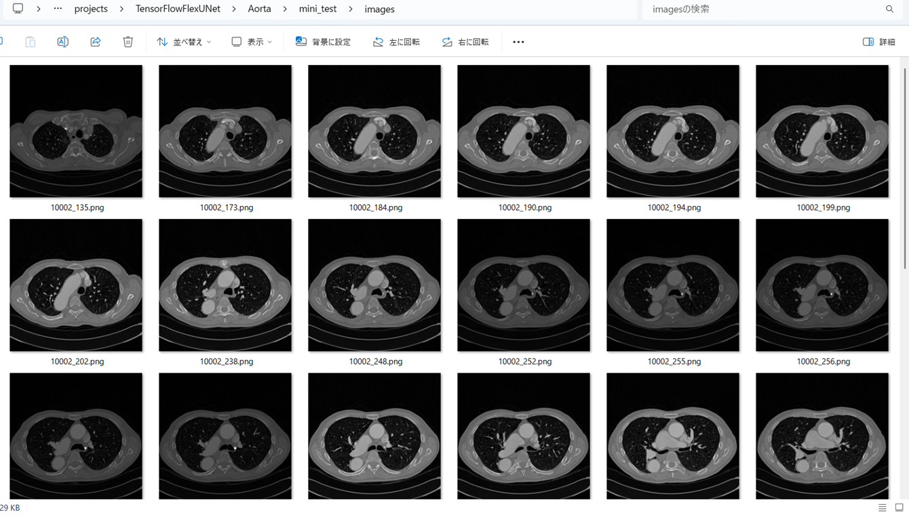 
<b>mini_test_mask(ground_truth)</b> 
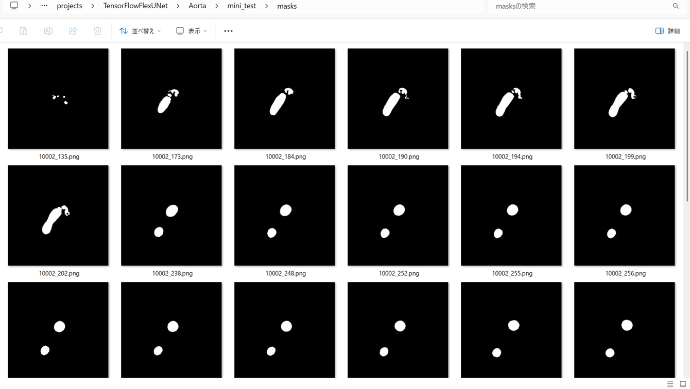 

<b>Inferred test masks</b> 
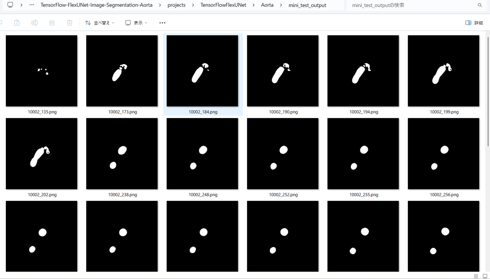 
 

<b>Enlarged images and masks for  Aorta  Images of 512x512 pixels</b> 
As shown below, the inferred masks predicted by our segmentation model trained by the dataset appear similar to the ground truth masks.
 
 
<table>
<tr>
<th>Input: image</th>
<th>Mask (ground_truth)</th>
<th>Prediction: inferred_mask</th>
</tr>
<tr>
<td>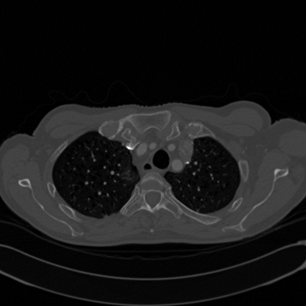</td>
<td></td>
<td></td>
</tr>

<tr>
<td></td>
<td>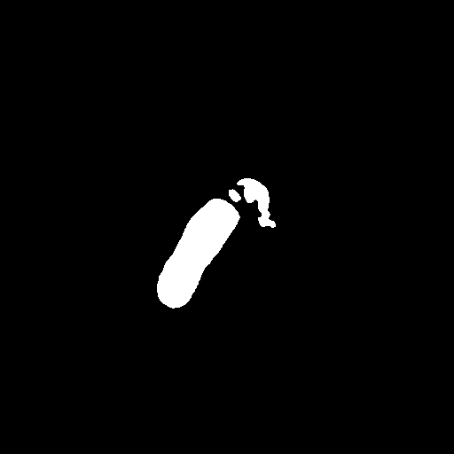</td>
<td></td>
</tr>

<tr>
<td>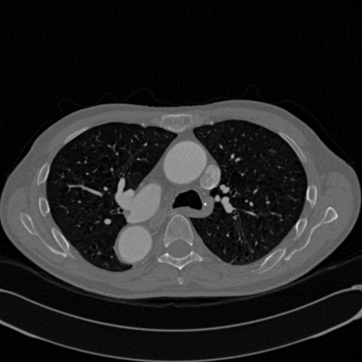</td>
<td></td>
<td></td>
</tr>
<tr>
<td>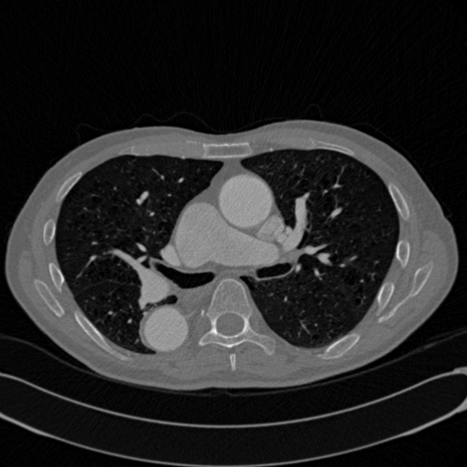</td>
<td></td>
<td></td>
</tr>
<tr>
<td>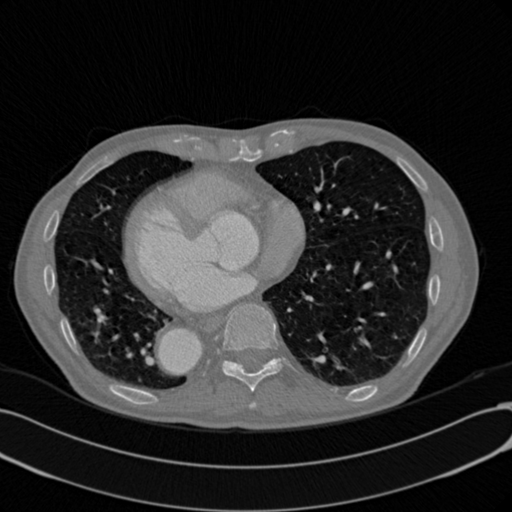</td>
<td></td>
<td></td>
</tr>
<tr>
<td>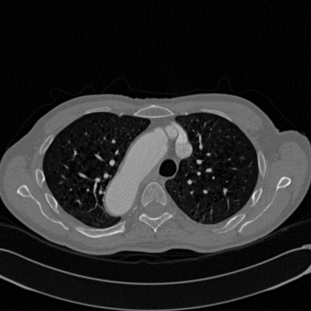</td>
<td>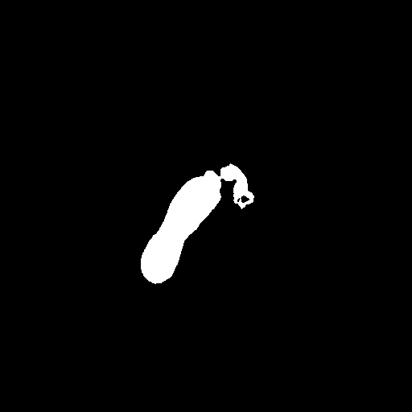</td>
<td></td>
</tr>
</table>

 
<h3>
References
</h3>
<b>1. Automated segmentation and quantification of the healthy and diseased aorta in CT angiographies using a dedicated deep learning approach</b> 
Malte Maria Sieren, Cornelia Widmann, Nick Weiss, Jan Hendrik Moltz, Florian Link, Franz Wegner,  
Erik Stahlberg, Marco Horn, Thekla Helene Oecherting, Jan Peter Goltz, Joerg Barkhausen & Alex Frydrychowicz  
<a href="https://link.springer.com/article/10.1007/s00330-021-08130-2">
https://link.springer.com/article/10.1007/s00330-021-08130-2</a>
  

<b>2. TensorFlow-FlexUNet-Image-Segmentation-Model</b> 
Toshiyuki Arai  
<a href="https://github.com/sarah-antillia/TensorFlow-FlexUNet-Image-Segmentation-Model">
https://github.com/sarah-antillia/TensorFlow-FlexUNet-Image-Segmentation-Model
</a>
 
 
